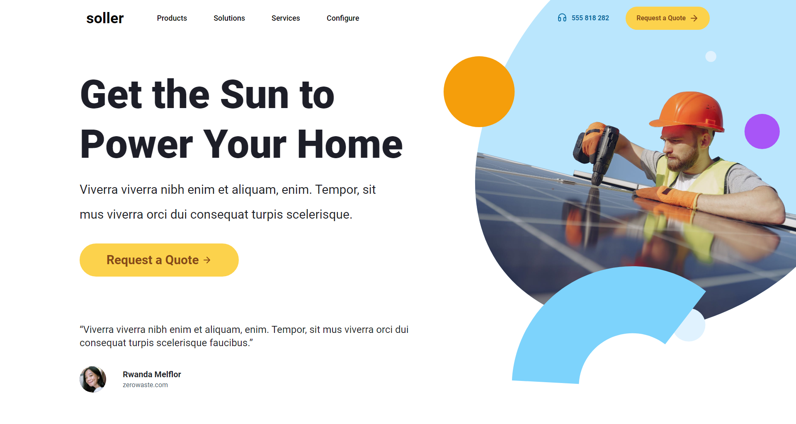

# Soller Landing Page



This application allows users to explore a static brand website. It has been developed using technologies such as React and Tailwind CSS.

## How to Run?

1. Download or clone the application:

    ```
    git clone https://github.com/Rekl0w/soller.git
    ```

2. Navigate to the project directory:

    ```
    cd soller
    ```

3. Install dependencies:

    ```
    npm install
    ```

4. Run the app.

    ```
    npm run dev
    ```

5. The magnifico application will start.

## Technologies Used

- React
- Javascript
- Tailwind
- Vite
- Glide.js
  
## Screenshots


## License

This project is licensed under the MIT License. See the [LICENSE](LICENSE) file for more information.
